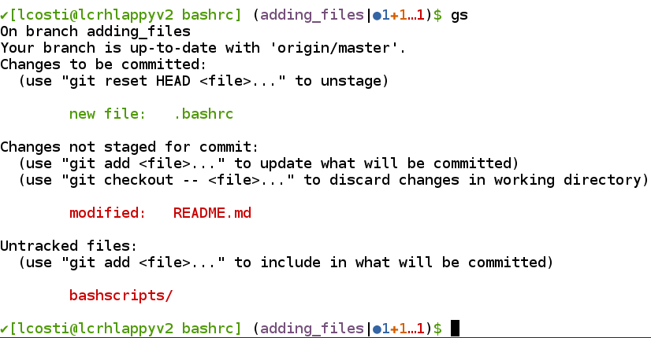

# Lucas' .bashrc

This is my `.bashrc` file. Feel free to clone/copy and reuse as you like.

I use two additional scripts for easier git usage, both of which are placed in my `~/baschscripts` directory. You can copy/clone these from their original repository.

* [`git-completion.bash`](https://github.com/git/git/blob/master/contrib/completion/git-completion.bash): This allows for git auto-completion on my git aliases. This allows me to press the `tab` key after entering a git alias to get things like branch names auto-completed.
* [`bash-git-prompt`](https://github.com/magicmonty/bash-git-prompt): A very handy bash prompt customisation that shows the status of the repository (things like the current branch, number of staged/modified/untracked files, etc.).

  

  I have included [my customised theme file](bashscripts/bash-git-prompt/themes/Single_line_Lucas.bgptheme) for `bash-git-prompt`.