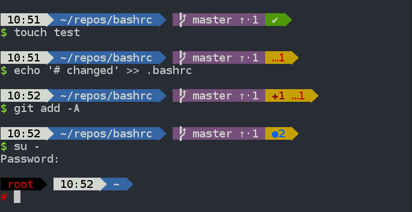

# Lucas' .bashrc

This is [my `.bashrc` file](.bashrc). Feel free to clone/copy and reuse as you like.

**NOTE**: Since commit [4ffd872](https://github.com/lucascosti/bashrc/commit/34f13a030692e524dacdad455fe5b282e4ffd872), my `.bashrc` file is used on my work Macbook (and thus the older version of bash that MacOS uses). The last commit that I used on Linux was [06c5849](https://github.com/lucascosti/bashrc/commit/fb3ce2b0c2193d27c20a6c4cb64bb443506c5849).

I use two additional scripts for easier git usage, both of which are placed in my `~/bashscripts` directory. You can download/clone these scripts from their original repositories (linked below).

* [`git-completion.bash`](https://github.com/git/git/blob/master/contrib/completion/git-completion.bash): This enables git auto-completion on my git aliases. This allows me to press the `tab` key after entering a git alias to auto-complete things, such as branch names.
* [`bash-git-prompt`](https://github.com/magicmonty/bash-git-prompt): A very handy bash prompt customisation that shows the status of the repository (things like the current branch, number of staged/modified/untracked files, etc.).
  
  I have also included my custom theme files for the `bash-git-prompt`. To use these themes, download them to your `bash-git-prompt/themes` directory, and change the `GIT_PROMPT_THEME` variable in your `.bashrc` file to the name of the theme.
  * [The most recent theme](bashscripts/bash-git-prompt/themes/Lucas_bullettrain_tags.bgptheme)  is for a dark background, and is inspired by the [bullet train theme](https://github.com/caiogondim/bullet-train-oh-my-zsh-theme) for `oh-my-zsh`. This theme requires that you use a [Powerline-patched font](https://github.com/powerline/fonts) in your terminal.
  
  * [The other theme](bashscripts/bash-git-prompt/themes/Single_line_Lucas.bgptheme), is my original one-line light-background theme that I used for a while.
  

